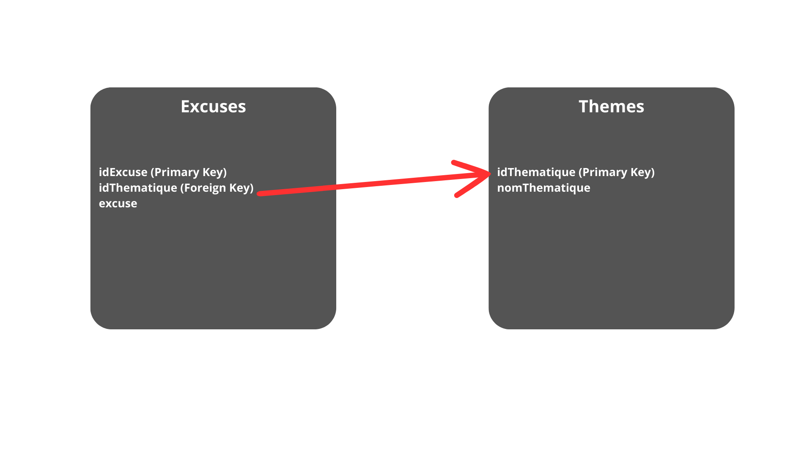
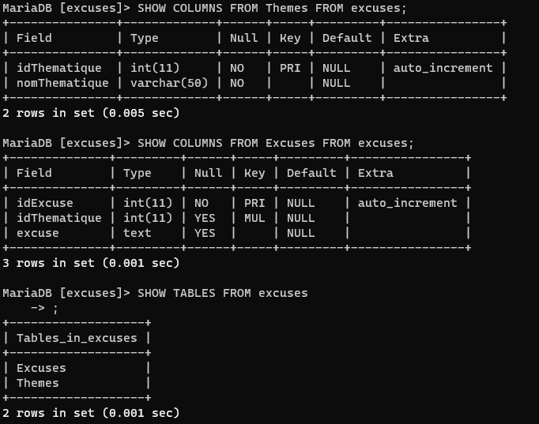

# Données fournies

**Voici le schéma de base de donné**





Nous pouvons remarqué que ces deux tables sont liées grâce au combo clé primaire clé étrangère idThematique.

# Dossier de travail

La route pour le dossier racine est la suivante : <span style="color:green">/var/www/html </span> <br>
Ce document est généralement nommé : <span style="color:green">DocumentRoot</span>

**Voici le code HTML**

```html
<!DOCTYPE html>
<html lang="fr">
  <head>
    <meta charset="UTF-8" />
    <meta name="viewport" content="width=device-width, initial-scale=1.0" />
    <title>Générateur d'excuses créatives</title>
  </head>
  <body>
    <h1>Générateur</h1>
    <p>Veuillez choisir votre thématique pour recevoir une excuse.</p>
    <form id="formulaireExcuse" action="traitement.php" method="post">
      <select name="thématique" id="thématique">
        <option value="1">Retard</option>
        <option value="2">Devoir non fait</option>
      </select>
      <input type="submit" />
    </form>
    <div id="result"></div>
    <script src="js/verification.js"></script>
  </body>
</html>
```

# Vérification en Javascript

**Voici le code JavaScript**

```js
let form_excuses = document.getElementById("formulaireExcuse");

form_excuses.addEventListener("submit", () => {
  let thematique = document.getElementById("thématique");
  let result = document.getElementById("result");
  result.innerHTML = `Excuse du theme ${thematique.value} en génération`;
});
```

# Script de traitement PHP

Nous allons utiliser la superglobal $\_POST afin de récupérer les valeurs du formulaire grâce au protocole HTTP.

**Voici le code PHP de connexion**

```php
<?php
// Variables de connexion
$servername = "localhost";
$username = "root";
$password = "PASSWORD";
$dbname = "excuses";

// Creation de la conexion
$pdo = new mysqli($servername, $username, $password, $dbname);

?>
```

**Voici le code PHP de traitement**

```php
<?php
//Connexion à la base de données
require_once('connexion/connexion.php');

//Récupère l'id de la thématique sélectionnée par l'user
$id = $_POST['thématique'];

function RandomExcuse($id, $pdo) {
    // Requete SQL pour obtenir tous les idExcuse pour un idThematique spécifique
    $query = $pdo->prepare('SELECT idExcuse FROM Excuses WHERE idThematique = ?');
    $query->bind_param('i', $id);
    $query->execute();

    $result = $query->get_result();

    // Récupérer tous les idExcuse dans un tableau
    $idExcuses = array();
    while ($row = $result->fetch_assoc()) {
        $idExcuses[] = $row['idExcuse'];
    }

    // Choisir un idExcuse aléatoirement
    $randomKey = array_rand($idExcuses);
    $randomIdExcuse = $idExcuses[$randomKey];

    return $randomIdExcuse;
}

$randomExcuse = RandomExcuse($id, $pdo);

// Requete SQL pour obtenir l'excuse aléatoire en fonction de la thématique
$querry = $pdo->prepare('SELECT * FROM Excuses WHERE idExcuse = ?');
$querry->bind_param('i', $randomExcuse);
$querry->execute();

$result = $querry->get_result();
$arr = $result->fetch_assoc();

// Affiche l'excuse aléatoire
echo $arr['excuse'];

echo '<br><br>';
echo '<ul><li>';
echo '<a href="index.html">Retour à l\'accueil</a>';
echo '</li><li>';
echo '<a href="ajout.html">Ajouter une excuse</a>';
echo '</li></ul>';

?>
```

# Formulaire d'ajout HTML

**Voici le code HTML**

```html
<!DOCTYPE html>
<html lang="fr">
  <head>
    <meta charset="UTF-8" />
    <meta name="viewport" content="width=device-width, initial-scale=1.0" />
    <title>Ajout d'excuses créatives</title>
  </head>
  <body>
    <h1>Nouvelle Excuse</h1>
    <p>Veuillez choisir votre thématique pour ajouter une excuse.</p>
    <form
      id="formulaireAjoutExcuse"
      action="ajout.php"
      method="post"
      onsubmit="return validateExcuse()"
    >
      <select name="thématique" id="thématique">
        <option value="1">Retard</option>
        <option value="2">Devoir non fait</option>
        <option value="3">Panne de réveil</option>
        <option value="4">Flemme</option>
        <option value="5">Oubli</option>
      </select>
      <input
        type="text"
        id="newExcuse"
        name="newExcuse"
        placeholder="Ecrivez votre nouvelle excuse"
      />
      <input type="submit" />
    </form>
    <div id="result"></div>
    <script src="js/ajout.js"></script>
  </body>
</html>
```

**Voici le code JS**

```js
let form_excuses = document.getElementById("formulaireAjoutExcuse");

function validateExcuse() {
  let newExcuse = document.getElementById("newExcuse").value;
  if (newExcuse.length < 20 || newExcuse.length > 100) {
    alert("L'excuse doit contenir entre 20 et 100 caractères.");
    return false;
  }
  let thematique = document.getElementById("thématique");
  let result = document.getElementById("result");
  result.innerHTML = `Votre excuse : ${newExcuse} <br> du theme ${thematique.value} est en cours d'ajout`;
  alert(
    `Votre excuse : ${newExcuse} , du theme ${thematique.value} a été ajoutée avec succès.`
  );
  return true;
}
```

# Script d'ajout

Nous allons utilisé une requete SQL d'insertion

```sql
INSERT INTO Excuses (idThematique, excuse) VALUES ()
```

Pour la redirection nous utiliserons la fonction de php header()

```php
header('Location: ');
```

**Voici le code PHP**

```php
<?php
//Connexion à la base de données
require_once('connexion/connexion.php');

// Récupération des données du formulaire
$idThematique = $_POST['thématique'];
$newExcuse = $_POST['newExcuse'];

// Préparation de la requête SQL
$queryAjout = $pdo->prepare('INSERT INTO Excuses (idThematique, excuse) VALUES (?, ?)');
$queryAjout->bind_param('is', $idThematique, $newExcuse); // is = première variable est un integer et deuxième est un string
$querryAjout->execute();

header('Location: /index.html'); // redirection vers la Homepage
exit;
?>
```

# Bonus

La liste des excuses et le menu de navigation ont été réalisé je vous laisse parcourir mon code pour les découvrir.
